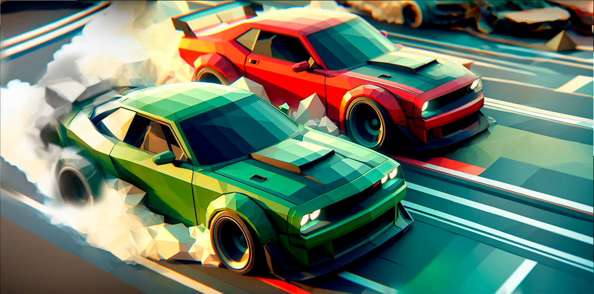
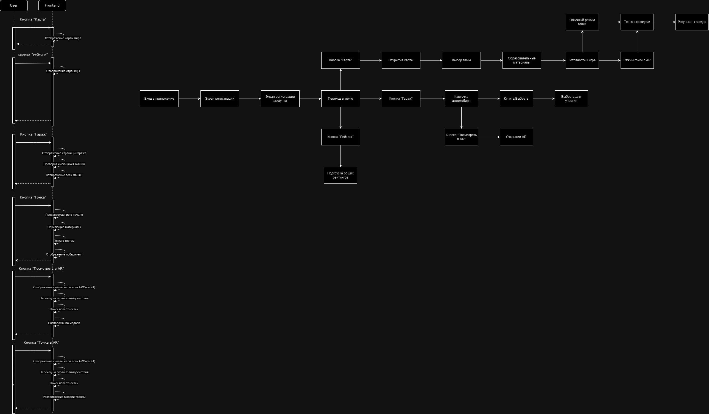

# Джуниор Гонки

Игра которая поможет в доступной и увлекательной форме обучить детей основам финансовой грамотности, расскажет про планирование бюджета, научит разумному обращению с деньгами и привлечет внимание к продуктам Тинькофф Джуниор.

[Презентация](Images/jun.pdf)

## Unity 2022.3.10f

## Наше решение

Игра на базе мобильного приложения, в которой пользователь проходит короткие обучающие блоки по финансовой грамотности и участвует в автомобильных гонках, победа в которых напрямую зависит от количества правильных ответов на вопросы по пройденному материалу.

Целевой аудиторией нашего продукта являются дети в возрасте 7-9 лет, которые еще не являются клиентами банковских продуктов Джуниор. Также в проекте заинтересованы родители, ищущие способы развить финансовые навыки у своих детей.

В основе нашей идеи лежит самостоятельное мобильное приложение, которое включает в себя короткие обучающие блоки, связанные с финансовой грамотностью, и автомобильные гонки. Победа в гонках напрямую зависит от того, насколько правильно участник ответит на вопросы по изученному материалу.
## Игровая механика:
1. На "Карте города" (список тем финансовой грамотности) пользователь выбирает "Район" (тему)
2. На экране появляются короткие текстовые блоки, простым языком объясняющие сложные экономические вопросы
3. После прохождения обучения пользователь принимает участие в гоночном заезде. Есть возможность открыть гонку в дополненной реальности. 
4. С помощью гоночного заезда мы реализовали процесс проверки знаний по пройденному материалу. Пока идет гонка, на экране игрока появляются тестовые вопросы, от скорости и правильности ответа на которые зависит скорость автомобиля.

Для удобства пользователей в приложении предусмотрен интуитивно понятный интерфейс, включающий в себя следующие элементы:
- Вход
- Профиль
- Главный экран
- Гараж
- Рейтинг
- Карта с выбором уровня

Чтобы сделать наше приложение еще более привлекательным, мы разработали виральную механику, которая включает в себя систему «пригласи друга», рейтинг друзей, возможность поделиться своими достижениями в соцсетях, фотографии с дополненной реальностью, награды за ежедневное посещение приложения и специальные награды внутри игры клиентам Тинькофф Джуниор.

## AR
Дополненная реальность представлена в виде гоночного заезда (опционально, у пользователя есть выбор: пройти заезд в 3D или AR), а также функционала фотографий с 3D моделью автомобиля, на котором размещен логотип Тинькофф Джуниор.

В данный момент игра реализована на уровне MVP: функционирует основной пользовательский путь, AR-модуль.

## Files
[Основная папка для презентации, там можно найти видео?](https://drive.google.com/drive/folders/1eEaLmyy1bZEoiSpS9sLTdUyK0duXJ2_A?usp=sharing)

[Дополнитеьные файлы](https://drive.google.com/drive/folders/1MhioJNCxB93a62FJZCFRl26M_muvKg35?usp=sharing)

[APK](https://github.com/Dream-Wood/AR-Car-Racing/releases)

[Figma](https://www.figma.com/file/BMqnmmRnQ7Ib6C8iRExYJB/Hack2.0?type=design&node-id=0%3A1&mode=design&t=ZbtM8BhBGgi9MMao-1)
